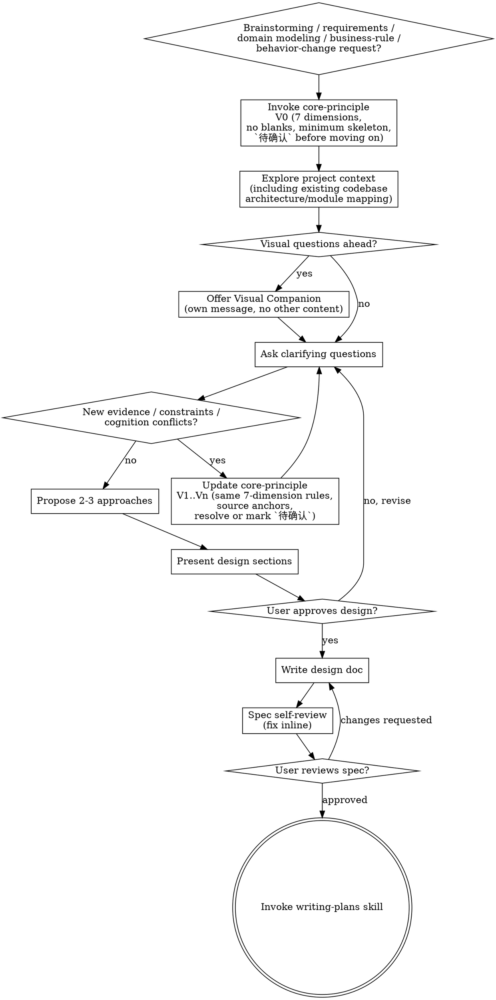

# Brainstorming Ideas Into Designs

Help turn ideas into fully formed designs and specs through natural collaborative dialogue.

Start by invoking `core-principle` to establish the initial cognition skeleton (`V0`). Then understand the current project context, or if this is greenfield work, decompose the system and clarify its boundaries. Keep updating core cognition (`V1..Vn`) as new information appears. Ask questions one at a time to refine the idea. Once you understand what you're building, present the design and get user approval.

**REQUIRED SUB-SKILL:** Use `superpowers:core-principle` as a continuous cognition thread for brainstorming. Build `V0` before context exploration, clarifying questions, approaches, or design discussion, then keep updating to `V1..Vn` during existing-codebase exploration, requirement clarification, and approach evaluation whenever new evidence, constraints, or conflicts appear. Apply it exactly: fixed 7-part cognition order, no skipped or blank dimensions, each dimension must reach the minimum verifiable skeleton expected by `core-principle`, write `待确认` in the current dimension before moving on when information is incomplete, and treat `界限` as availability conditions plus execution consequences.

<HARD-GATE>
Do NOT invoke any implementation skill, write any code, scaffold any project, or take any implementation action until you have presented a design and the user has approved it. This applies to EVERY project regardless of perceived simplicity.
</HARD-GATE>

## Anti-Pattern: "This Is Too Simple To Need A Design"

Every project goes through this process. A todo list, a single-function utility, a config change — all of them. "Simple" projects are where unexamined assumptions cause the most wasted work. The design can be short (a few sentences for truly simple projects), but you MUST present it and get approval.

## Checklist

You MUST create a task for each of these items and complete them in order:

1. **Run and maintain core-principle loop** — for brainstorming, requirements clarification, domain modeling, business-rule analysis, and behavior-change analysis, invoke `superpowers:core-principle` before anything else to build `V0`; during existing-codebase exploration, clarifying questions, and approach comparison, continuously update to `V1..Vn` when new evidence/constraints/conflicts appear; always keep the exact gate: fixed 7-part cognition order, no skipped or blank dimensions, each dimension reaches the minimum verifiable skeleton, and `待确认` is recorded in the current dimension before moving on
2. **Explore project context** — when there is an existing project, check files, docs, recent commits; for greenfield system design with no existing repo context, go straight to system decomposition and core cognition
3. **Offer visual companion** (if topic will involve visual questions) — this is its own message, not combined with a clarifying question. See the Visual Companion section below.
4. **Ask clarifying questions** — one at a time, understand purpose/constraints/success criteria; when the topic is a new multi-subsystem system, prioritize subsystem boundary and dependency questions before field details; when decisive attribute details are missing, prioritize focused questions about type, uniqueness, editability, requiredness, length, and precision
5. **Propose 2-3 approaches** — with trade-offs and your recommendation
6. **Present design** — in sections scaled to their complexity, get user approval after each section
7. **Write design doc** — save to `docs/superpowers/specs/YYYY-MM-DD-<topic>-design.md` and commit; if the design doc is `<=1000` lines, keep core cognition in the same design doc; if the design doc is `>1000` lines, create `docs/superpowers/specs/YYYY-MM-DD-<topic>-core-cognition.md` and reference it from the design doc; for new multi-subsystem systems, write the total-system design first, then decide which subsystem gets its own follow-up spec
8. **Spec review loop** — dispatch spec-document-reviewer subagent with precisely crafted review context (never your session history); fix issues and re-dispatch until approved (max 1 iterations, then surface to human)
9. **User reviews written spec** — ask user to review the spec file before proceeding
10. **Transition to implementation** — invoke writing-plans skill to create implementation plan

## Process Flow

**The terminal state is invoking writing-plans.** Do NOT invoke frontend-design, mcp-builder, or any other implementation skill. The ONLY skill you invoke after brainstorming is writing-plans.

## The Process

**Understanding the idea:**

- In brainstorming contexts, treat `core-principle` as default. Build `V0` before context exploration or clarifying questions, including existing-codebase architecture/module exploration.
- During context exploration, clarifying questions, and approach comparison, if new evidence/constraints/conflicts appear, update to `V1..Vn` before continuing.
- Follow `core-principle` exactly in every update: structure, classification, relationships, attributes, states, functions, `界限`; no skipped or blank dimensions; each dimension must reach the minimum verifiable skeleton; if the current dimension is incomplete, write `待确认` there before entering the next one.
- In this context, `界限` means availability conditions plus execution consequences, not a generic architecture boundary label.
- If missing attribute details would affect validation, storage, state transitions, availability conditions, outputs, or document structure, ask focused clarification questions before treating the design as stable. Cover type, uniqueness, editability, requiredness, length, and precision.
- When the user already knows the result should become a design doc, shape the questions and later presentation around the target structure. For rule-heavy work, prefer `功能模块 -> 实体与属性 / 关系与状态 / 功能点` so the answers map directly into the final document.
- Do not rationalize this away because the user wants speed, brevity, or a "rough brainstorm". Those are exactly the situations where missing states and boundaries creates bad designs.
- Check out the current project state first (files, docs, recent commits) when working in an existing project, and fold findings back into the 7 dimensions with source anchors; if this is greenfield system design with no repo context, go straight to system decomposition and core cognition
- Before asking detailed questions, assess scope: if the request describes multiple independent subsystems (e.g., "build a platform with chat, file storage, billing, and analytics"), flag this immediately. Don't spend questions refining details of a project that needs to be decomposed first.
- If the project is too large for a single spec, help the user decompose into sub-projects: what are the independent pieces, how do they relate, what order should they be built?
- If the user is creating a brand-new system and explicitly wants subsystem-level understanding, do NOT jump straight to only the first sub-project. First complete the overall subsystem split and establish per-subsystem core cognition.
- For each subsystem in that split, make sure the discussion covers: its role in the total system, which other subsystems exist around it, which subsystems it depends on, which subsystems depend on it, and how those relationships work.
- After the overall split and per-subsystem cognition are stable, either continue with the full system-level design doc or choose the first subsystem for deeper design, depending on the user's goal. Each sub-project still gets its own spec → plan → implementation cycle when implementation planning begins.
- For appropriately-scoped projects, ask questions one at a time to refine the idea
- Prefer multiple choice questions when possible, but open-ended is fine too
- Only one question per message - if a topic needs more exploration, break it into multiple questions
- Focus on understanding: purpose, constraints, success criteria

**Exploring approaches:**

- Propose 2-3 different approaches with trade-offs
- Present options conversationally with your recommendation and reasoning
- Lead with your recommended option and explain why

**Presenting the design:**

- Once you believe you understand what you're building, present the design
- Scale each section to its complexity: a few sentences if straightforward, up to 200-300 words if nuanced
- Ask after each section whether it looks right so far
- Cover: architecture, components, data flow, error handling, testing
- Be ready to go back and clarify if something doesn't make sense

**Design for isolation and clarity:**

- Break the system into smaller units that each have one clear purpose, communicate through well-defined interfaces, and can be understood and tested independently
- For each unit, you should be able to answer: what does it do, how do you use it, and what does it depend on?
- Can someone understand what a unit does without reading its internals? Can you change the internals without breaking consumers? If not, the boundaries need work.
- Smaller, well-bounded units are also easier for you to work with - you reason better about code you can hold in context at once, and your edits are more reliable when files are focused. When a file grows large, that's often a signal that it's doing too much.

**Working in existing codebases:**

- Explore the current structure before proposing changes. Follow existing patterns.
- Where existing code has problems that affect the work (e.g., a file that's grown too large, unclear boundaries, tangled responsibilities), include targeted improvements as part of the design - the way a good developer improves code they're working in.
- Don't propose unrelated refactoring. Stay focused on what serves the current goal.

## After the Design

**Documentation:**

- Write the validated design (spec) to `docs/superpowers/specs/YYYY-MM-DD-<topic>-design.md`
  - (User preferences for spec location override this default)
- Document split rule by source line count:
  - If design doc `<=1000` lines: do not create a separate core cognition doc; keep a compact "核心认知" section in the design doc
  - If design doc `>1000` lines: create `docs/superpowers/specs/YYYY-MM-DD-<topic>-core-cognition.md` and reference it from the design doc instead of duplicating large sections
- Avoid large cross-document duplication: cognition = facts/constraints, spec = decisions/trade-offs; connect by section references
- If the work starts as a new multi-subsystem system design, prefer a document shape like `总系统概览 -> 子系统划分 -> 子系统依赖总览 -> 子系统逐个展开`
- For new multi-subsystem systems, finish the total-system design doc first; only after that decide whether a specific subsystem needs its own follow-up spec and implementation cycle
- Use elements-of-style:writing-clearly-and-concisely skill if available
- Commit the design document to git

**Spec Self-Review:**
After writing the spec document, look at it with fresh eyes:

1. **Placeholder scan:** Any "TBD", "TODO", incomplete sections, or vague requirements? Fix them.
2. **Internal consistency:** Do any sections contradict each other? Does the architecture match the feature descriptions?
3. **Scope check:** Is this focused enough for a single implementation plan, or does it need decomposition?
4. **Ambiguity check:** Could any requirement be interpreted two different ways? If so, pick one and make it explicit.

Fix any issues inline. No need to re-review — just fix and move on.

**User Review Gate:**
After the spec review loop passes, ask the user to review the written spec before proceeding:

> "Spec written and committed to `<path>`. Please review it and let me know if you want to make any changes before we start writing out the implementation plan."

Wait for the user's response. If they request changes, make them and re-run the spec review loop. Only proceed once the user approves.

**Implementation:**

- Invoke the writing-plans skill to create a detailed implementation plan
- Do NOT invoke any other skill. writing-plans is the next step.

## Key Principles

- **Core cognition first and continuous** - Build `V0` with `core-principle` before brainstorming, then keep updating `V1..Vn` throughout context exploration and clarification; pass the same exact gate on every update before continuing
- **One question at a time** - Don't overwhelm with multiple questions
- **Multiple choice preferred** - Easier to answer than open-ended when possible
- **YAGNI ruthlessly** - Remove unnecessary features from all designs
- **Explore alternatives** - Always propose 2-3 approaches before settling
- **Incremental validation** - Present design, get approval before moving on
- **Be flexible** - Go back and clarify when something doesn't make sense

## Visual Companion

A browser-based companion for showing mockups, diagrams, and visual options during brainstorming. Available as a tool — not a mode. Accepting the companion means it's available for questions that benefit from visual treatment; it does NOT mean every question goes through the browser.

**Offering the companion:** When you anticipate that upcoming questions will involve visual content (mockups, layouts, diagrams), offer it once for consent:
> "Some of what we're working on might be easier to explain if I can show it to you in a web browser. I can put together mockups, diagrams, comparisons, and other visuals as we go. This feature is still new and can be token-intensive. Want to try it? (Requires opening a local URL)"

**This offer MUST be its own message.** Do not combine it with clarifying questions, context summaries, or any other content. The message should contain ONLY the offer above and nothing else. Wait for the user's response before continuing. If they decline, proceed with text-only brainstorming.

**Per-question decision:** Even after the user accepts, decide FOR EACH QUESTION whether to use the browser or the terminal. The test: **would the user understand this better by seeing it than reading it?**

- **Use the browser** for content that IS visual — mockups, wireframes, layout comparisons, architecture diagrams, side-by-side visual designs
- **Use the terminal** for content that is text — requirements questions, conceptual choices, tradeoff lists, A/B/C/D text options, scope decisions

A question about a UI topic is not automatically a visual question. "What does personality mean in this context?" is a conceptual question — use the terminal. "Which wizard layout works better?" is a visual question — use the browser.

If they agree to the companion, read the detailed guide before proceeding:
`skills/brainstorming/visual-companion.md`
