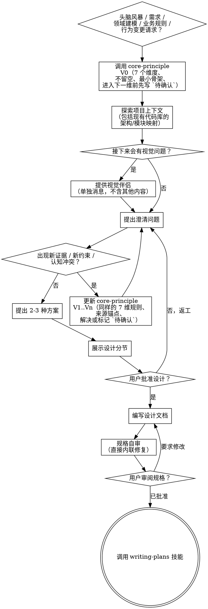

# 将想法打磨成设计

通过自然、协作式对话，把想法沉淀成完整的设计和规格说明。

先调用 `core-principle` 建立初始认知骨架（`V0`）。然后理解当前项目上下文；如果是全新项目，就先拆解系统并澄清边界。随着新信息出现，持续更新核心认知（`V1..Vn`）。一次只问一个问题来细化想法。等你真正理解要构建什么之后，再展示设计并取得用户批准。

**必需子技能：** 在 brainstorming 过程中，把 `superpowers:core-principle` 作为持续认知主线使用。在做上下文探索、澄清问题、方案比较或设计讨论前先构建 `V0`；在现有代码库探索、需求澄清和方案评估过程中，只要出现新的证据、约束或冲突，就持续更新到 `V1..Vn`。必须严格执行：认知顺序固定为 7 个部分，不允许跳过或留空；每一维都必须达到 `core-principle` 要求的最小可验证骨架；当信息不完整时，必须先在当前维度写下 `待确认`，再进入下一维；并且要把 `界限` 视为可用条件加执行后果。

**必需路径子技能（写文档/计划时）：** 在写入或引用任何任务级设计/计划路径之前，先使用 `superpowers:document-workspace-layout`。优先解析 `DESIGN_DOC_PATH`、`CORE_COGNITION_PATH`、`PLAN_PATH`、`PLAN_CHANGELOG` 和 `TASK_WORKSPACE_DIR`。

<HARD-GATE>
在你已经展示设计且用户明确批准之前，不要调用任何实现技能、不要写任何代码、不要搭建任何项目、也不要执行任何实现动作。无论项目看起来多简单，这条规则都适用。
</HARD-GATE>

## 反模式：“这个太简单了，不需要设计”

每个项目都必须经过这套流程。待办清单、单函数工具、配置修改，全都一样。所谓“简单”项目，往往最容易因为未被检视的假设而返工最多。设计可以很短（对真的非常简单的项目，几句话就够），但你必须展示出来并获得批准。

## 检查清单

你必须为下列每一项创建任务，并按顺序完成：

1. **运行并维护 core-principle 循环**：对于头脑风暴、需求澄清、领域建模、业务规则分析和行为变更分析，在做任何别的事之前先调用 `superpowers:core-principle` 构建 `V0`；在现有代码库探索、澄清问题和方案对比过程中，只要出现新的证据、约束或冲突，就持续更新到 `V1..Vn`；始终保持同一门槛：固定 7 维认知顺序、不跳过、不留空、每一维都达到最小可验证骨架，并且在进入下一维之前，把 `待确认` 记录在当前维度。
2. **探索项目上下文**：如果已有现成项目，先用 `superpowers:document-workspace-layout` 解析 `TASK_WORKSPACE_DIR`，然后检查那里的文件、文档和最近提交；如果是没有现有仓库上下文的全新系统设计，则直接进入系统拆解和核心认知。
3. **提供视觉伴侣**（如果主题会涉及视觉问题）：这必须单独发一条消息，不能和澄清问题放在一起。详见下方“视觉伴侣”章节。
4. **提出澄清问题**：一次只问一个，理解目标、约束和成功标准；如果主题是一个新的多子系统系统，优先问子系统边界和依赖，再问字段细节；如果缺少关键属性细节，优先围绕类型、唯一性、可编辑性、必填性、长度和精度提出聚焦问题。
5. **提出 2-3 种方案**：说明权衡，并给出你的推荐。
6. **展示设计**：按复杂度分段展示，每一节展示后都获取用户确认。
7. **编写设计文档**：使用 `superpowers:document-workspace-layout` 解析 `DESIGN_DOC_PATH`；把已确认的设计保存到那里并提交；若设计文档 `<=1000` 行，则把核心认知保留在同一份设计文档里；若设计文档 `>1000` 行，则创建 `CORE_COGNITION_PATH` 并在设计文档中引用它；对于新的多子系统系统，先写总系统设计，再决定哪个子系统需要后续独立规格。
8. **规格评审循环**：派发 spec-document-reviewer 子代理，并给出精确构造的评审上下文（绝不要传你的会话历史）；修复问题后重新派发，直到通过（最多 1 轮，否则交给人工）。
9. **用户审阅已写好的规格**：在继续之前，请用户先审阅规格文件。
10. **计划影响检查 + 变更日志**：当本轮核心认知文档或设计文档发生变化时，主动检查现有实现计划是否也需要更新；如果需要，使用 `superpowers:document-workspace-layout` 解析 `PLAN_PATH` 和 `PLAN_CHANGELOG`，然后调用 writing-plans 更新计划入口文件及受影响的分片文件，并追加任务级变更日志。
11. **切换到实现阶段**：只有在计划同步完成之后才能进行；调用 writing-plans 技能来创建或更新实现计划。

## 流程图

**终态就是调用 writing-plans。** 不要调用 frontend-design、mcp-builder 或任何其他实现技能。brainstorming 之后，你唯一可以调用的技能就是 writing-plans。

如果核心认知/设计发生变化，而实现计划已经存在，那么在进入这个终态之前，必须立刻执行 **计划影响检查 + 变更日志**：使用 `superpowers:document-workspace-layout` 解析 `PLAN_PATH` 和 `PLAN_CHANGELOG`，先通过 writing-plans 更新计划入口文件和所有受影响的分片文件，再追加任务级变更日志。

## 过程

**理解想法：**

- 在 brainstorming 场景里，把 `core-principle` 视为默认选项。在上下文探索或澄清问题之前先构建 `V0`，包括对现有代码库架构/模块的探索。
- 在上下文探索、澄清问题和方案对比过程中，只要出现新的证据、约束或冲突，就先更新到 `V1..Vn` 再继续。
- 每次更新都要严格遵守 `core-principle`：结构、分类、关系、属性、状态、功能、`界限`；不允许跳过或留空；每一维都必须达到最小可验证骨架；如果当前维度尚未完整，必须先在那里写下 `待确认`，再进入下一维。
- 在这里，`界限` 指的是可用条件加执行后果，而不是泛泛的架构边界标签。
- 如果缺失的属性细节会影响校验、存储、状态流转、可用条件、输出或文档结构，那么在把设计视为稳定之前，必须先问聚焦的澄清问题。重点覆盖类型、唯一性、可编辑性、必填性、长度和精度。
- 如果用户已经明确知道结果会写成设计文档，那么提问和后续展示都要围绕目标文档结构来组织。对于规则较重的工作，优先采用 `功能模块 -> 实体与属性 / 关系与状态 / 功能点` 这种结构，这样答案可以直接映射到最终文档。
- 不要因为用户要求快速、简洁或“先粗略脑暴一下”就试图跳过这套流程。这恰恰是最容易因为状态和边界遗漏而做出糟糕设计的场景。
- 在处理现有项目时，先检查当前项目状态。如果任务级文档/计划已在使用中，先通过 `superpowers:document-workspace-layout` 解析 `TASK_WORKSPACE_DIR` 并在其中探索，再把发现连同来源锚点折回到 7 个维度中；如果是没有仓库上下文的全新系统设计，则直接进入系统拆解和核心认知。
- 在问字段级细节之前，先评估范围：如果请求描述的是多个彼此独立的子系统（例如“做一个包含聊天、文件存储、计费和分析的平台”），要立刻指出这一点。不要在一个本该先拆解的项目里，直接开始打磨细节。
- 如果项目对单份规格来说太大，就帮助用户把它拆成子项目：独立部分有哪些、它们如何关联、应该按什么顺序构建。
- 如果用户在创建一个全新系统，并且明确想先理解子系统层级，不要立刻只跳到第一个子项目。先完成整体子系统划分，并为每个子系统建立核心认知。
- 在该拆分中的每个子系统上，都要确保讨论涵盖：它在总系统中的角色、周围还存在哪些其他子系统、它依赖哪些子系统、哪些子系统依赖它，以及这些关系如何运作。
- 当整体拆分和各子系统认知稳定后，再根据用户目标，决定是继续写完整系统级设计文档，还是挑选第一个子系统做深入设计。等进入实现计划阶段时，每个子项目仍然要走自己独立的 规格 -> 计划 -> 实现 周期。
- 对于范围合适的项目，一次只问一个问题来逐步细化。
- 能用多选题时优先用多选题，但开放式问题也可以。
- 每条消息只问一个问题；如果某个主题需要更多探索，就拆成多轮。
- 聚焦理解：目标、约束、成功标准。

**探索方案：**

- 提出 2-3 种不同方案，并说明权衡。
- 用对话式方式呈现选项，同时说明你的推荐和理由。
- 先讲你推荐的方案，并解释原因。

**展示设计：**

- 当你认为自己已经理解要构建什么时，就展示设计。
- 每一节长度随复杂度而定：简单场景几句话即可，复杂场景可写到 200-300 字。
- 每展示完一节，都要问用户这一节目前看起来是否正确。
- 覆盖：架构、组件、数据流、错误处理、测试。
- 如果哪里说不通，要准备回退并继续澄清。

**为隔离与清晰而设计：**

- 把系统拆成更小的单元，让每个单元都只有一个清晰职责，通过定义明确的接口通信，并且能够被独立理解和测试。
- 对每个单元，你都应该能回答：它做什么、怎么使用、依赖什么？
- 一个人能否在不阅读内部实现的情况下理解这个单元的职责？你能否在不破坏使用方的前提下修改其内部实现？如果不能，说明边界还不够好。
- 更小、更有边界感的单元也更利于你工作。你更擅长推理那些能一次性放进上下文的代码；而当文件足够聚焦时，你的修改也更可靠。文件一旦变大，往往说明它承担了过多职责。

**在现有代码库中工作：**

- 在提出变更前先探索当前结构，并遵循现有模式。
- 如果现有代码里存在会影响这项工作的具体问题（例如文件过大、边界不清、职责纠缠），可以把有针对性的改进纳入设计，这正是优秀工程师在实际工作中的做法。
- 不要提出无关的重构。始终围绕当前目标。

## 设计之后

**文档：**

- 在写入任何任务级文档或引用任何代码路径前，使用 `superpowers:document-workspace-layout` 解析 `DESIGN_DOC_PATH`、`CORE_COGNITION_PATH`、`PLAN_CHANGELOG` 和 `TASK_WORKSPACE_DIR`
- 将确认后的设计（spec）写入 `DESIGN_DOC_PATH`
  - 如果用户已经给出另一种兼容的文档契约，则遵循那份契约
- 按源码行数决定文档拆分规则：
  - 如果设计文档 `<=1000` 行：不要创建独立的核心认知文档；把简洁版“核心认知”保留在设计文档里
  - 如果设计文档 `>1000` 行：创建 `CORE_COGNITION_PATH`，并在设计文档中引用它，而不是复制大段内容
- 避免跨文档大规模重复：认知文档负责事实/约束，规格文档负责决策/权衡；通过章节引用把两者连接起来
- 如果工作起点是一个新的多子系统系统设计，优先采用 `总系统概览 -> 子系统划分 -> 子系统依赖总览 -> 子系统逐个展开` 这样的文档形态
- 对于新的多子系统系统，先完成总系统设计文档；之后再决定某个具体子系统是否需要自己的后续规格和实现周期
- 如果可用，使用 `elements-of-style:writing-clearly-and-concisely` 技能
- 将设计文档提交到 Git
- 如果核心认知/设计的变化可能影响现有实现计划，那么在开始实现前必须做计划影响检查。如果计划受影响，先通过 `superpowers:document-workspace-layout` 解析 `PLAN_PATH` 和 `PLAN_CHANGELOG`，然后调用 writing-plans 更新计划入口文件及受影响的分片文件，并记录：
  - 时间戳
  - 触发文档的绝对路径
  - 受影响计划文件的绝对路径
  - 简洁的变更摘要
  - 执行者
- 在计划/文档漂移未解决之前，不要继续实现。

**规格自审：**
写完规格文档后，用全新的视角再看一遍：

1. **占位符扫描：** 有没有 “TBD”“TODO”、未完成章节或模糊要求？有就修掉。
2. **内部一致性：** 各章节之间是否互相矛盾？架构是否与功能描述一致？
3. **范围检查：** 这份规格是否足够聚焦，适合单个实现计划？还是需要进一步拆解？
4. **歧义检查：** 某个要求是否可能被两种方式理解？如果会，就选定一种并明确写出来。

发现问题就直接原地修复。不需要重新发起评审，修完继续往下走即可。

**用户评审门：**
规格评审循环通过后，要求用户先审阅已写好的规格，再进入下一步：

> "Spec written and committed to `<DESIGN_DOC_PATH>`. Please review it and let me know if you want to make any changes before we start writing out the implementation plan."

等待用户回应。如果用户要求修改，就做修改并重新执行规格评审循环。只有用户批准之后，才能继续。

**实现：**

- 调用 writing-plans 技能，创建或更新详细的实现计划
- 如果这次调用是由核心认知/设计变更触发，而计划原本已经存在，那么在更新完计划入口文件和受影响的分片文件之后，立即向 `PLAN_CHANGELOG` 追加一条记录
- 不要调用任何其他技能。下一步只能是 writing-plans

## 关键原则

- **核心认知优先且持续进行**：在 brainstorming 开始前用 `core-principle` 构建 `V0`，然后在上下文探索和澄清过程中持续更新 `V1..Vn`；每次更新都要通过同一套门槛才能继续
- **一次只问一个问题**：不要一次抛出太多问题
- **优先多选**：比开放问答更容易回答
- **狠抓 YAGNI**：从所有设计里删掉不必要的功能
- **比较多种方案**：定案前总是先提出 2-3 个方案
- **增量校验**：先展示设计，获得批准后再前进
- **保持灵活**：哪里说不通，就回去继续澄清

## 视觉伴侣

这是一个基于浏览器的伴随工具，用于在 brainstorming 过程中展示 mockup、图表和视觉化选项。它是一个工具，而不是一种模式。用户接受使用视觉伴侣，表示它可以在适合视觉表达的问题上被启用；并不意味着所有问题都必须通过浏览器处理。

**如何提供视觉伴侣：** 当你预期接下来的问题会包含视觉内容（mockup、布局、图表）时，要先单独征求一次同意：
> "Some of what we're working on might be easier to explain if I can show it to you in a web browser. I can put together mockups, diagrams, comparisons, and other visuals as we go. This feature is still new and can be token-intensive. Want to try it? (Requires opening a local URL)"

**这条邀请必须单独成消息。** 不要和澄清问题、上下文总结或任何其他内容混在一起。这条消息里只能包含上面的邀请文本，别的都不要写。发出后等待用户回复；如果用户拒绝，就继续用纯文本方式进行 brainstorming。

**逐题决策：** 即使用户已经接受，也要针对每一个问题判断是该用浏览器还是终端。判断标准只有一个：**用户看见这个内容，会不会比只读文字更容易理解？**

- **使用浏览器**：适合本身就是视觉内容的东西，例如 mockup、线框图、布局对比、架构图、并排视觉方案
- **使用终端**：适合文本内容，例如需求问题、概念选择、权衡列表、A/B/C/D 文本选项、范围决策

一个问题即便和 UI 有关，也不自动意味着它是视觉问题。“在这里 personality 是什么意思？”是概念问题，用终端；“哪个 wizard 布局更好？”是视觉问题，用浏览器。

如果用户同意启用视觉伴侣，在继续前先阅读详细指南：
`skills/brainstorming/visual-companion.md`
