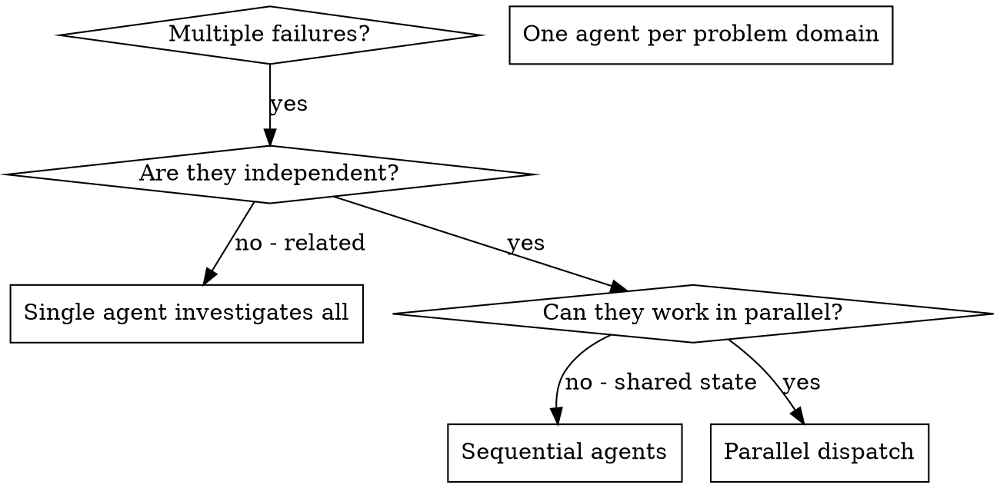

# 并行派发代理

## 概述

你要把任务委派给具有隔离上下文的专门代理。通过精确设计它们的指令和上下文，你可以让它们保持聚焦，并顺利完成各自任务。它们不应继承你当前会话的上下文或历史记录，你应只提供它们真正需要的内容。这样也能保留你自己的上下文，用于协调工作。

**限制条件：** 本技能只能在用户手动调用或明确要求时使用。即使当前存在多个彼此独立的问题，也不能自动触发。

当你面对多个彼此无关的失败问题时（不同测试文件、不同子系统、不同 bug），按顺序逐个调查是在浪费时间。每项调查彼此独立，可以并行进行。

**核心原则：** 每个独立问题域派发一个代理，让它们并发工作。

## 何时使用



**仅在用户明确要求时，以下场景才适用：**
- 3 个以上测试文件失败，且根因各不相同
- 多个子系统各自独立损坏
- 每个问题都可以在不依赖其他问题上下文的前提下被理解
- 各项调查之间不存在共享状态

**即使符合下列情况，也不能自动使用：**
- 你判断并行处理会更快
- 当前 harness 支持多个代理
- 问题天然可以拆成多个独立子任务

**不适用场景：**
- 失败问题彼此相关，修复一个可能连带修复其他问题
- 需要先理解整个系统的完整状态
- 多个代理之间会互相干扰

## 模式

### 1. 识别独立问题域

按“哪里坏了”来分组：
- 文件 A 测试：工具审批流程
- 文件 B 测试：批处理完成行为
- 文件 C 测试：中止功能

每个问题域彼此独立。例如，修复工具审批问题不会影响中止相关测试。

### 2. 为代理创建聚焦任务

每个代理应获得：
- **明确范围：** 一个测试文件或一个子系统
- **清晰目标：** 让这些测试通过
- **约束条件：** 不要修改其他代码
- **预期输出：** 总结你发现了什么、修复了什么

### 3. 并行派发

```typescript
// 在 Claude Code / AI 环境中
Task("修复 agent-tool-abort.test.ts 的失败")
Task("修复 batch-completion-behavior.test.ts 的失败")
Task("修复 tool-approval-race-conditions.test.ts 的失败")
// 三个任务会并发运行
```

### 4. 审查并集成

当代理返回后：
- 阅读每份总结
- 验证修复之间没有冲突
- 运行完整测试套件
- 集成所有改动

## 代理提示词结构

好的代理提示词应当具备：
1. **聚焦：** 只针对一个清晰的问题域
2. **自包含：** 包含理解问题所需的全部上下文
3. **明确输出：** 说明代理最终要返回什么

```markdown
修复 src/agents/agent-tool-abort.test.ts 中失败的 3 个测试：

1. "should abort tool with partial output capture" - 期望消息中包含 'interrupted at'
2. "should handle mixed completed and aborted tools" - 快速工具被中止了，而不是完成
3. "should properly track pendingToolCount" - 期望得到 3 个结果，实际得到 0 个

这些是时序 / race condition 问题。你的任务：

1. 阅读测试文件，理解每个测试在验证什么
2. 找出根因：是时序问题，还是实际 bug？
3. 通过以下方式修复：
   - 用基于事件的等待替换任意超时
   - 如果发现中止实现存在 bug，则修复它
   - 如果测试验证的是已变化的行为，则调整测试预期

不要只是增加超时时间，要找出真正的问题。

返回：总结你发现了什么，以及你修复了什么。
```

## 常见错误

**❌ 过于宽泛：** “把所有测试都修掉” - 代理容易失焦  
**✅ 具体明确：** “修复 agent-tool-abort.test.ts” - 范围清晰

**❌ 没有上下文：** “修复这个 race condition” - 代理不知道问题在哪  
**✅ 提供上下文：** 粘贴错误信息和测试名

**❌ 没有约束：** 代理可能把所有内容都重构一遍  
**✅ 明确约束：** “不要修改生产代码” 或 “只修测试”

**❌ 输出含糊：** “修好它” - 你无法知道改了什么  
**✅ 输出具体：** “返回根因和修改内容的总结”

## 何时不要使用

**用户没有明确要求并行派发代理：** 不能启用本技能  
**失败彼此相关：** 修一个可能带动修复其他问题，先合并调查  
**需要完整上下文：** 理解问题必须看到整个系统  
**探索式调试：** 你还不知道具体哪里坏了  
**存在共享状态：** 代理会互相干扰（编辑同一文件、使用同一资源）

## 来自当前会话的真实示例

**场景：** 一次大型重构后，3 个文件里出现 6 个测试失败

**失败情况：**
- agent-tool-abort.test.ts：3 个失败（时序问题）
- batch-completion-behavior.test.ts：2 个失败（工具未执行）
- tool-approval-race-conditions.test.ts：1 个失败（执行次数 = 0）

**判断：** 这些问题域彼此独立。中止逻辑、批处理完成逻辑、race condition 分属不同问题。

**派发方式：**
```
代理 1 → 修复 agent-tool-abort.test.ts
代理 2 → 修复 batch-completion-behavior.test.ts
代理 3 → 修复 tool-approval-race-conditions.test.ts
```

**结果：**
- 代理 1：将超时等待替换为基于事件的等待
- 代理 2：修复事件结构 bug（threadId 放错位置）
- 代理 3：增加等待，确保异步工具执行完成

**集成结果：** 所有修复彼此独立，没有冲突，完整测试套件全部通过

**节省的时间：** 3 个问题并行解决，而不是串行逐个处理

## 关键收益

1. **并行化** - 多项调查可同时进行
2. **聚焦** - 每个代理范围更窄，需要跟踪的上下文更少
3. **独立性** - 各代理互不干扰
4. **速度** - 用解决 1 个问题的时间解决 3 个问题

## 验证

代理返回后：
1. **审阅每份总结** - 理解具体改动
2. **检查是否冲突** - 代理是否修改了相同代码
3. **运行完整测试套件** - 验证所有修复能一起工作
4. **抽样复核** - 代理也可能系统性出错

## 真实世界影响

来自一次调试会话（2025-10-03）：
- 3 个文件里有 6 个失败
- 并行派发了 3 个代理
- 所有调查并发完成
- 所有修复成功集成
- 代理改动之间零冲突
