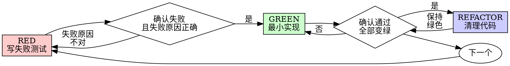

# 测试驱动开发（TDD）

## 概览

先写测试。亲眼看它失败。再写最小代码让它通过。

**核心原则：** 如果你没有亲眼看见测试失败，你就不知道它测的到底是不是正确的东西。

**违背规则的字面要求，就是违背规则的精神。**

## 何时使用

**仅在用户明确要求时使用：**
- 用户明确要求使用 TDD
- 用户明确要求“先写测试再实现”
- 用户明确要求按测试驱动开发流程工作

**即使符合下列场景，也不能自动使用：**
- 新功能
- Bug 修复
- 重构
- 行为变更

**如果用户没有明确要求：**
- 不要因为任务类型自动进入 TDD
- 先按用户指定的工作方式执行，或先征求用户是否要用 TDD


如果你脑子里出现“这次就先跳过 TDD 吧”，停下。这只是自我合理化。

## 铁律

```
没有先失败的测试，就不准写生产代码
```

先写了代码再补测试？删掉。重新开始。

**没有例外：**
- 不要把那段代码留着当“参考”
- 不要一边写测试一边“顺手改造”它
- 不要再去看它
- “删掉”就是真的删掉

从测试重新实现。没有讨论空间。

## 红-绿-重构



### RED：写失败测试

写一个最小测试，明确说明应该发生什么。

<Good>
```typescript
test('重试失败操作 3 次后成功', async () => {
  let attempts = 0;
  const operation = () => {
    attempts++;
    if (attempts < 3) throw new Error('fail');
    return 'success';
  };

  const result = await retryOperation(operation);

  expect(result).toBe('success');
  expect(attempts).toBe(3);
});
```
命名清晰，测试真实行为，只测一件事
</Good>

<Bad>
```typescript
test('retry works', async () => {
  const mock = jest.fn()
    .mockRejectedValueOnce(new Error())
    .mockRejectedValueOnce(new Error())
    .mockResolvedValueOnce('success');
  await retryOperation(mock);
  expect(mock).toHaveBeenCalledTimes(3);
});
```
命名模糊，测的是 mock，不是代码
</Bad>

**要求：**
- 只测一个行为
- 命名清晰
- 尽量使用真实代码（除非无法避免，否则不要用 mock）

### Verify RED：亲眼看它失败

**强制。绝不能跳过。**

```bash
npm test path/to/test.test.ts
```

确认：
- 测试确实失败了（不是报错）
- 失败信息符合预期
- 失败是因为功能缺失（不是拼写错误之类的问题）

**测试通过了？** 说明你测的是现有行为。去修测试。

**测试报错了？** 修正错误，重新运行，直到它以正确原因失败。

### GREEN：最小实现

写出刚好足够让测试通过的最简单代码。

<Good>
```typescript
async function retryOperation<T>(fn: () => Promise<T>): Promise<T> {
  for (let i = 0; i < 3; i++) {
    try {
      return await fn();
    } catch (e) {
      if (i === 2) throw e;
    }
  }
  throw new Error('unreachable');
}
```
刚好够用，足以通过
</Good>

<Bad>
```typescript
async function retryOperation<T>(
  fn: () => Promise<T>,
  options?: {
    maxRetries?: number;
    backoff?: 'linear' | 'exponential';
    onRetry?: (attempt: number) => void;
  }
): Promise<T> {
  // YAGNI
}
```
过度设计
</Bad>

不要顺手加功能、重构别的代码，或做超出测试要求的“改进”。

### Verify GREEN：亲眼看它通过

**强制。**

```bash
npm test path/to/test.test.ts
```

确认：
- 测试通过
- 其他测试仍然通过
- 输出干净（没有错误、没有告警）

**测试没过？** 修代码，不要改测试。

**其他测试失败了？** 现在就修。

### REFACTOR：清理

只有在绿色之后才能做：
- 去重
- 改善命名
- 提取辅助函数

保持测试为绿。不要增加新行为。

### 重复

接着为下一个功能写下一个失败测试。

## 什么是好测试

| 质量 | 好 | 坏 |
|---------|------|-----|
| **最小化** | 只测一件事。名字里有 “and”？那就拆开。 | `test('validates email and domain and whitespace')` |
| **清晰** | 测试名能说明行为 | `test('test1')` |
| **体现意图** | 能展示期望 API | 看不出代码本该做什么 |

## 为什么顺序重要

**“我先写代码，之后再写测试验证一下就好”**

代码写完后再补的测试，通常一运行就通过。测试一运行就通过，什么也证明不了：
- 可能测错了东西
- 可能测的是实现细节，而不是行为
- 可能漏掉了你已经忘掉的边界情况
- 你从来没看见它真正抓住过那个 bug

测试先行会强迫你先看到它失败，从而证明它确实在测试某个真实内容。

**“边界情况我已经手工测过了”**

手工测试是临时性的。你以为自己测全了，但实际上：
- 没有测试记录
- 代码一变就不能自动重跑
- 压力一大就容易漏场景
- “我试过一次能跑” ≠ 全面覆盖

自动化测试是系统性的。它每次都会以同样方式执行。

**“删掉已经写了 X 小时的代码太浪费了”**

这是沉没成本谬误。时间已经花掉了。你现在的选择只有两个：
- 删掉，按 TDD 重写（再花 X 小时，但信心高）
- 留着，事后补测试（省 30 分钟，但信心低，而且大概率埋雷）

真正的浪费，是把你无法信任的代码留在系统里。没有真实测试支撑的“可运行代码”，本质上就是技术债。

**“TDD 太教条了，真正务实的人会灵活应对”**

TDD 本来就是务实：
- 在提交前发现 bug（比提交后调试更快）
- 防止回归（测试会立刻发现破坏）
- 文档化行为（测试直接展示代码该怎么用）
- 支持重构（放心改，测试帮你兜底）

所谓“务实”的捷径，往往只是把调试时间推迟到生产环境。

**“事后补测试也能达到同样目标，重点是精神不是仪式”**

不对。事后补测试回答的是“这段代码现在做了什么？”；测试先行回答的是“它应该做什么？”

事后补测试会被你的实现结果所绑架。你测的是你已经写出来的东西，而不是需求本身。你验证的是自己还记得的边界，而不是一开始就被迫发现的边界。

测试先行会迫使你在实现前发现边界情况。事后补测试只是验证你有没有把所有场景都记住，而你通常记不住。

事后补 30 分钟测试 ≠ TDD。你得到的是一些覆盖率，失去的是“这些测试确实能发现问题”的证明。

## 常见借口

| 借口 | 现实 |
|--------|---------|
| "Too simple to test" | 简单代码一样会坏。写测试只要 30 秒。 |
| "I'll test after" | 一运行就通过的测试什么都证明不了。 |
| "Tests after achieve same goals" | 事后测试是在问“它做了什么？”，测试先行是在问“它应该做什么？” |
| "Already manually tested" | 临时试过 ≠ 系统验证。没有记录，也不能自动重跑。 |
| "Deleting X hours is wasteful" | 沉没成本谬误。留下未验证代码才是真浪费。 |
| "Keep as reference, write tests first" | 你迟早会去“参考并改造”它。那仍然是事后补测试。删掉就是真的删掉。 |
| "Need to explore first" | 可以。先探索，但把探索代码扔掉，再从 TDD 开始。 |
| "Test hard = design unclear" | 听测试的。难测试通常说明设计也难用。 |
| "TDD will slow me down" | TDD 比调试更快。真正务实就是先写测试。 |
| "Manual test faster" | 手工测试无法证明边界情况，而且每次改动都得重来。 |
| "Existing code has no tests" | 那你就从这里开始补起来。 |

## 红旗信号：停下，重新开始

- 先写了代码才补测试
- 测试写在实现之后
- 测试一运行就通过
- 说不清测试为什么失败
- 测试准备“之后再补”
- 说服自己“就这一次”
- “我已经手工测过了”
- “事后补测试也一样”
- “重点是精神，不是流程”
- “先留着当参考”或“基于现有代码改一改”
- “已经写了 X 小时，删掉太浪费”
- “TDD 太教条了，我这是务实”
- “这次情况不一样，因为……”

**以上任何一句出现，都意味着：删掉代码，用 TDD 重新开始。**

## 示例：修 Bug

**Bug：** 允许提交空邮箱

**RED**
```typescript
test('拒绝空邮箱', async () => {
  const result = await submitForm({ email: '' });
  expect(result.error).toBe('Email required');
});
```

**Verify RED**
```bash
$ npm test
FAIL: expected 'Email required', got undefined
```

**GREEN**
```typescript
function submitForm(data: FormData) {
  if (!data.email?.trim()) {
    return { error: 'Email required' };
  }
  // ...
}
```

**Verify GREEN**
```bash
$ npm test
PASS
```

**REFACTOR**
如果多个字段都需要类似校验，再提取验证逻辑。

## 验证清单

在把工作标记为完成之前：

- [ ] 每个新增函数/方法都有测试
- [ ] 每个测试都在实现前亲眼看见过失败
- [ ] 每个测试都因为预期原因失败（功能缺失，而不是拼写错误）
- [ ] 为每个测试只写了最小通过实现
- [ ] 所有测试都通过
- [ ] 输出干净（没有错误、没有告警）
- [ ] 测试使用真实代码（除非无法避免，否则不用 mock）
- [ ] 边界情况和错误路径都已覆盖

有任何一项打不了勾？说明你跳过了 TDD。重新开始。

## 卡住时怎么办

| 问题 | 解决方式 |
|---------|----------|
| 不知道怎么测 | 先写你希望看到的 API，先写断言，再问人工协作者。 |
| 测试太复杂 | 设计太复杂。简化接口。 |
| 什么都得 mock | 代码耦合太深。改用依赖注入。 |
| 测试搭建特别大 | 提取辅助方法；如果仍然很复杂，就继续简化设计。 |

## 与调试的结合

发现 bug 了？先写一个失败测试来复现它。然后完整走一遍 TDD 循环。测试既能证明修复成立，也能防止回归。

没有测试，不要修 bug。

## 测试反模式

当你要加 mock 或测试工具时，先阅读 `@testing-anti-patterns.md`，避免这些常见问题：
- 测的是 mock 行为，不是真实行为
- 为了测试给生产类加测试专用方法
- 在不了解依赖关系的前提下盲目 mock

## 最终规则

```
生产代码 -> 必须先有测试，而且该测试先失败过
否则 -> 这就不是 TDD
```

没有人工协作者许可，就没有例外。
