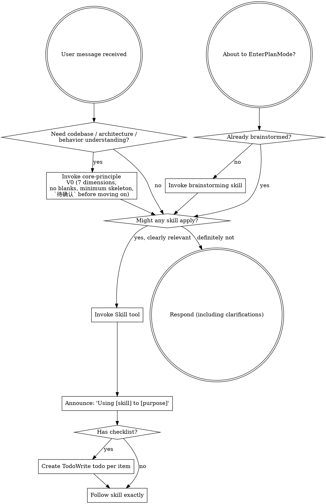

<SUBAGENT-STOP>
If you were dispatched as a subagent to execute a specific task, skip this skill.
</SUBAGENT-STOP>

<IMPORTANT>
Skills are available for use when you need them. Invoke skills when they are relevant and helpful to your task. If a skill clearly applies, use it. Use your best judgment — you don't need to invoke every skill "just in case."
</IMPORTANT>

## Instruction Priority

Superpowers skills override default system prompt behavior, but **user instructions always take precedence**:

1. **User's explicit instructions** (CLAUDE.md, GEMINI.md, AGENTS.md, direct requests) — highest priority
2. **Superpowers skills** — override default system behavior where they conflict
3. **Default system prompt** — lowest priority

If CLAUDE.md, GEMINI.md, or AGENTS.md says "don't use TDD" and a skill says "always use TDD," follow the user's instructions. The user is in control.

## How to Access Skills

**In Claude Code:** Use the `Skill` tool. When you invoke a skill, its content is loaded and presented to you—follow it directly. Never use the Read tool on skill files.

**In Gemini CLI:** Skills activate via the `activate_skill` tool. Gemini loads skill metadata at session start and activates the full content on demand.

**In other environments:** Check your platform's documentation for how skills are loaded.

## Platform Adaptation

Skills use Claude Code tool names. Non-CC platforms: see `references/codex-tools.md` (Codex) for tool equivalents. Gemini CLI users get the tool mapping loaded automatically via GEMINI.md.

# Using Skills

## The Rule

**Invoke skills when they are clearly relevant to your task.** If you're unsure whether a skill applies, it's fine to check. If an invoked skill turns out to be wrong for the situation, you don't need to use it.

## Required Handoff

`core-principle` is a cognition gate, not a substitute for `brainstorming`.

If `core-principle` applies because the task involves new functionality, behavior changes, rule changes, backward compatibility, impact isolation, cross-module or cross-repo changes, or interface/display consistency changes, you MUST evaluate and invoke `brainstorming` next before any implementation-oriented action.

Do not stop at `core-principle` in those cases. Finish the cognition gate, then continue into `brainstorming`.

## Skill Priority

When multiple skills could apply, use this order:

1. **Process skills first** (brainstorming, debugging) - these determine HOW to approach the task
2. **Implementation skills second** (frontend-design, mcp-builder) - these guide execution

"Inspect this repo" / "help me understand this module" / "what changes if we alter this behavior?" → `core-principle` first, then other applicable skills.
"Let's build X" → brainstorming first, then implementation skills.
"Fix this bug" → debugging first, then domain-specific skills.

For existing-codebase exploration, architecture or module understanding, and behavior-change analysis, treat `core-principle` as the default process skill. Build `V0` before exploration or clarification; if the task also needs design decisions, compatibility decisions, or impact-scope control, `brainstorming` is the next required skill before any implementation-oriented action. If new evidence, constraints, or conflicts appear, keep updating `V1..Vn` while selecting and applying the next skill.

## Skill Types

**Rigid** (TDD, debugging): Follow exactly. Don't adapt away discipline.

**Flexible** (patterns): Adapt principles to context.

The skill itself tells you which.

## User Instructions

Instructions say WHAT, not HOW. "Add X" or "Fix Y" doesn't mean skip workflows.
